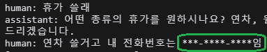

# ONEBIZ 챗봇 프로젝트

## 📌 프로젝트 개요

ONEBIZ 챗봇은 인공지능 수행 비서로, 기업 경영 관리의 효율성을 높이고 반복적인 업무를 자동화하여 시간을 절약하는 솔루션입니다.

### 🎯 목적

**LLM(대형 언어 모델)** 을 활용하여 업무 처리의 편의성 및 시간 절감을 실현

정보 접근성을 개선하여 사용자가 원하는 정보를 빠르게 찾을 수 있도록 지원

### 🚨 필요성

+ 1️⃣ 정보 접근성 부족

   - 메뉴가 많아 원하는 정보를 찾기 어려움
   - 실시간 답변을 제공하는 기능이 없음
   - 기존 ONEBIZ는 통합 경영 관리 기능만 제공

+ 2️⃣ 반복적이고 비효율적인 업무 처리

   - 사용자가 원하는 정보를 예측하거나 맞춤형 제안 불가능
   - 신청서 작성 등 반복적인 작업이 비효율적

## 고려한 점

### 💡 LLM 챗봇을 선택한 이유

일반적인 규칙 기반 챗봇과 비교했을 때 LLM 챗봇이 제공하는 주요 장점은 다음과 같습니다.

| 항목 | 규칙 기반 챗봇 | LLM 챗봇 |
| --- | --- | --- |
| 유연성 | 제한된 시나리오에서만 작동 | 다양한 질문에 대응 가능 |
| 확장성 | 신규 질문 추가 시 수정 필요 | 지속적 학습을 통한 기능 확장 |
| 맥락 이해 | 단일 질문에 대한 응답 제공 | 대화 흐름을 기억하고 응답 가능 |

### 🚀 ONEBIZ 챗봇의 차별점

+ 사용자 요청에 따라 자동으로 신청서를 작성
+ 일반적인 질의응답을 넘어 실제 업무 처리 지원

### 🔗 아키텍처 및 흐름도

### 🔒 보안 및 운영 고려 사항

+ 1️⃣ 사내 민감 정보 유출 방지

   - 정규식 필터링: 개인정보 및 중요 데이터 자동 차단

   | 정규식 필터링 | 정규식 필터링 결과 |
   | --- | --- |
   |  |  |
   - 유사도 기반 필터링: 제공하지 않는 정보에 대한 응답 제한

+ 2️⃣ 요금 및 토큰 제한
   OpenAI의 종량제 요금 정책 고려하여 운영
   - 사용자 당 하루 최대 3,000자 제한
   - 단일 요청당 최대 300자 입력 제한

+ 3️⃣ 문맥 유지 및 세션 관리
   - 사용자가 세션 중단 후 재접속해도 문맥 유지
   - 각 채팅방은 특정 신청서 처리를 위해 생성
   - 대화 내용은 1시간 동안 유지하여 작업 지속 가능

---

ONEBIZ 챗봇은 단순한 챗봇이 아니라, **기업의 업무 생산성을 높이고 자동화를 지원하는 스마트한 AI 도우미**입니다. 🚀

